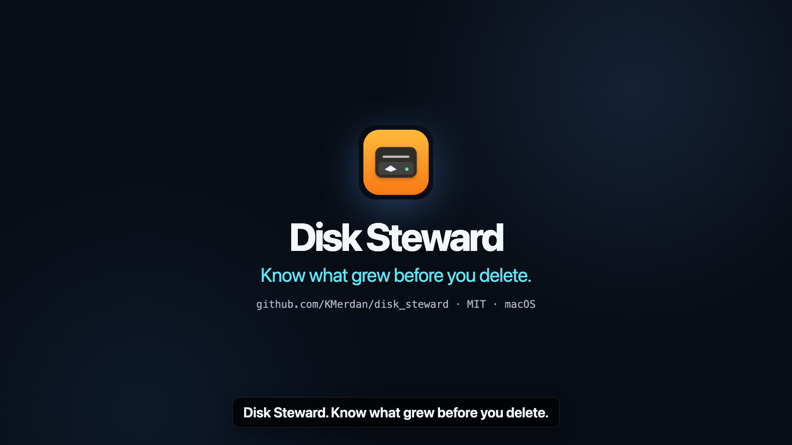
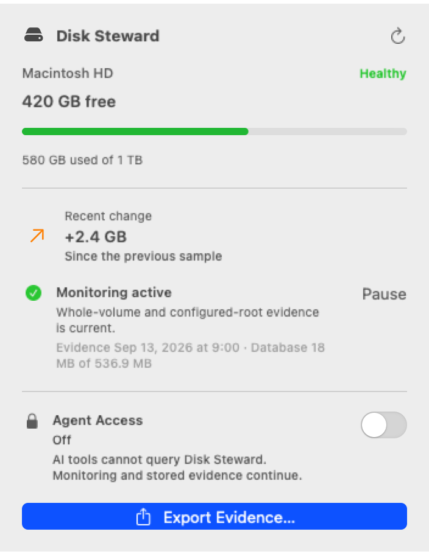
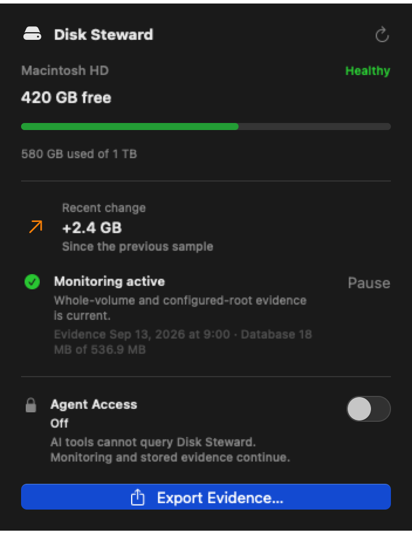

<div align="center">
  
  <h1>Disk Steward</h1>
  <p><strong>Understand what is consuming your Mac—and hand an AI agent evidence it can actually use.</strong></p>
  <p>A private, native menu-bar monitor for disk growth, bounded file metadata, and read-only MCP investigation.</p>
  <p>
    
    
    <a href="https://github.com/KMerdan/disk_steward/releases/tag/v1.0.0"></a>
    <a href="LICENSE"></a>
  </p>
</div>

<p align="center">
  <a href="docs/media/disk-steward-promo-30s.mp4">
    
  </a>
</p>
<p align="center">
  <strong><a href="docs/media/disk-steward-promo-30s.mp4">Watch the 30-second product story</a></strong>
  ·
  <a href="docs/research/promo-30s-transcript.md">Read the timecoded transcript and research</a>
</p>

<table>
  <tr>
    <td align="center"><strong>Light</strong></td>
    <td align="center"><strong>Dark</strong></td>
  </tr>
  <tr>
    <td></td>
    <td></td>
  </tr>
</table>

Disk usage tools are good at showing a snapshot. Disk Steward is designed for the harder question: **what changed, where, when, and how confidently do we know?** It keeps a bounded local evidence history, presents the important part in the menu bar, and can export an integrity-checked bundle for a human, Codex, or Claude Code.

## What it does

- **Shows storage health at a glance.** Capacity, free space, recent growth, monitoring health, and evidence recency stay in one compact native popover.
- **Monitors at two honest scopes.** Whole-volume capacity is measured separately from detailed metadata under folders you explicitly watch.
- **Builds a durable evidence chain.** Disk Steward tracks current presence, changes, coverage gaps, provenance confidence, retention, and deleted or out-of-scope objects without pretending partial scans are complete.
- **Exports actionable evidence.** A manual export contains a human brief plus machine-readable current state, events, snapshots, provenance, sessions, coverage, lifecycle, rollups, and integrity hashes.
- **Offers local, read-only MCP tools.** Agent Access is off by default and can be toggled independently of monitoring. The connector cannot delete files or change settings.
- **Keeps its own footprint bounded.** Recent exact detail ages into summaries, retention is controlled by time and bytes, and reduced coverage is recorded rather than hidden.

## How it fits together

```text
Whole-volume samples ─┐
Watched-folder scans ─┼─> bounded SQLite evidence ─┬─> native menu-bar status
Filesystem hints ─────┘                            ├─> integrity-checked export
                                                   └─> private Unix socket
                                                        └─> read-only MCP helper
                                                            ├─> Codex
                                                            └─> Claude Code
```

The app owns the evidence database. The MCP helper communicates with the running app through a private current-user Unix socket; it never opens SQLite directly and never exposes a network listener.

## Agent evidence, without another disk dig

When Agent Access is enabled, the bundled `disk-witness-mcp` helper exposes bounded read-only tools:

| Question | Tool |
| --- | --- |
| How full is the disk, and how fresh is the evidence? | `get_storage_summary` |
| What exact detail and time ranges are still retained? | `get_evidence_lifecycle` |
| What is consuming space inside covered roots now? | `list_current_consumers` |
| What grew or shrank over a trustworthy interval? | `explain_growth` |
| What process or agent may have created a change? | `get_provenance` |
| What did an agent session affect? | `get_task_impact` |
| What present objects deserve human cleanup review? | `find_cleanup_candidates` |
| Can I get a portable evidence package? | `export_evidence` |

See [agent integration setup](docs/integrations/README.md) and the [MCP trust contract](docs/architecture/mcp.md) for Codex and Claude Code installation, session registration, limits, and failure behavior.

## Privacy and safety

Disk Steward is an evidence tool, not a cleanup tool.

- File **metadata** is observed; file contents and environment values are not collected.
- Evidence stays on the Mac unless the user explicitly exports and shares it.
- MCP is local, read-only, and disabled on a fresh install.
- Manual exports are user-owned and are never silently deleted by retention.
- No feature deletes files, purges caches, terminates processes, or uploads telemetry.
- Optional Endpoint Security provenance is isolated from the standard app and is not required for normal monitoring, export, or MCP access.

The complete model is documented in [privacy and retention](docs/operations/privacy-and-retention.md), [evidence object lifecycle](docs/architecture/evidence-object-lifecycle.md), and the [actionable export contract](docs/architecture/evidence-export.md).

## Install

Disk Steward 1.0.0 is Developer ID signed, hardened, notarized, and distributed as a universal macOS app through the public Homebrew tap:

```sh
brew trust KMerdan/disk-steward
brew tap KMerdan/disk-steward
brew install --cask disk-steward
```

The first command explicitly trusts this third-party tap for current and future casks. You can also download the notarized archive from the [v1.0.0 release](https://github.com/KMerdan/disk_steward/releases/tag/v1.0.0).

## Build and run

### Requirements

- macOS 13 or newer
- Xcode with a Swift 6 toolchain (currently validated with Xcode 26.3)
- No signing identity for package development and tests

Clone and open the native app:

```sh
git clone https://github.com/KMerdan/disk_steward.git
cd disk_steward
open DiskSteward.xcodeproj
```

Select the shared **DiskSteward** scheme and run it. Disk Steward is an `LSUIElement` menu-bar app, so it intentionally does not appear in the Dock.

For command-line development:

```sh
swift package resolve
swift build
swift test
swift run DiskStewardApp
```

To regenerate and build the Xcode project after editing `Config/Packaging/project.yml`:

```sh
Scripts/Development/build_xcode_project
```

## Evidence export

Choose **Export Evidence…** from the menu-bar app. A successful export opens its completed directory in Finder. Start with `codex-brief.md`; `manifest.json` and `integrity.json` define and verify the structured payloads beside it.

An export deliberately distinguishes:

- whole-volume capacity from file-detail coverage;
- current presence from historical activity or deletion;
- complete observations from partial, stale, unavailable, or excluded scope; and
- exact provenance from correlation or inference.

That distinction is what lets an agent choose the next investigation without treating missing evidence as proof.

## Project map

| Path | Purpose |
| --- | --- |
| `Sources/DiskStewardApp` | AppKit/SwiftUI menu-bar application and local IPC owner |
| `Sources/DiskStewardCore` | Monitoring, evidence store, lifecycle, export, privacy, and provenance |
| `Sources/DiskStewardMCP` | Local stdio MCP connector with read-only tools |
| `DiskSteward.xcodeproj` | Native app bundle, signing, resources, and schemes |
| `Integrations` | Codex and Claude Code configuration templates |
| `Schemas` and `Fixtures` | Versioned evidence and MCP contracts |
| `Tests` | Unit, contract, integration, safety, performance, and release checks |
| `Packaging/Homebrew` | Canonical release cask and notarized-release checklist |
| `promo` | Reproducible Remotion source for the public 30-second product story |
| `docs` | Architecture, operations, release, and evidence design notes |

## Distribution status

Disk Steward 1.0.0 is publicly available from the [`KMerdan/disk-steward` Homebrew tap](https://github.com/KMerdan/homebrew-disk-steward) and as a versioned GitHub release. The published archive has passed Developer ID identity, nested-helper signature, hardened runtime, secure timestamp, production entitlement, notarization staple, Gatekeeper, and archive round-trip checks.

Release engineering is documented in [direct distribution](docs/operations/distribution.md), the [release handoff](docs/release/direct-distribution-handoff.md), and the [Homebrew activation checklist](Packaging/Homebrew/README.md).

## Contributing

Issues and focused pull requests are welcome. Please keep changes native, local-first, read-only at the agent boundary, and explicit about evidence coverage and uncertainty. Run `swift test` and `git diff --check` before opening a pull request.

## License

Disk Steward is available under the [MIT License](LICENSE).
